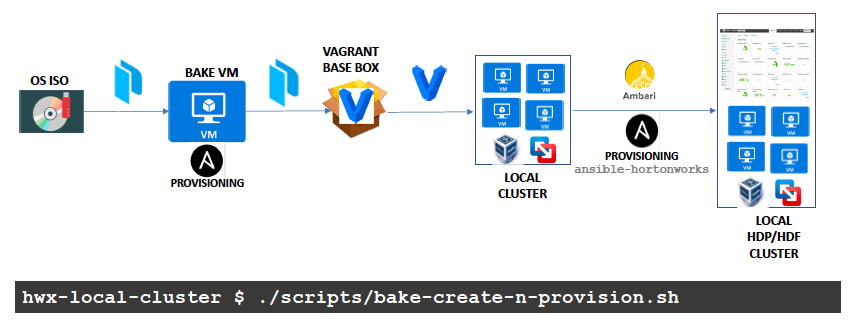

# HWX Local Cluster

Create local HWX (HDP/HDF) clusters with a single command !

Leverages the following tools and the [ansible-hortonworks](https://github.com/hortonworks/ansible-hortonworks) project

## Prerequisites:

 * [VirtualBox](https://www.virtualbox.org/)
 * [Vagrant](https://www.vagrantup.com/)
 * [Packer](https://www.packer.io/)
 * [Ansible](https://www.ansible.com/)
 * [Git client](https://git-scm.com/)
 * [python | pip | virtualenv](https://packaging.python.org/guides/installing-using-pip-and-virtualenv/)

## Workflow
 



## Environment Tested

   ```
   macOS High Sierra 10.13.4
   python 2.7.14 | pip 9.0.3 | virtualenv 15.2.0 
   Git 2.16.3
   VirtualBox 5.2.8
   Vagrant 2.0.3
   Packer v1.2.2
   Ansible 2.3.3.0
   ```
   for

   - [x] CentOS 7
   - [x] VirtualBox
   - [ ] VMWare Workstation / Fusion

## Steps

 1. Setup `virtualenv` for Ansible
    ```
    $ virtualenv ansible2.3

    $ source ansible2.3/bin/activate

    (ansible2.3) $ 
    ```

2. Clone the project
    ```
    (ansible2.3) $ git clone https://github.com/amolthacker/hwx-local-cluster.git && \
                   cd hwx-local-cluster

    (ansible2.3) hwx-local-cluster $

    ```

3. Update the Setup and Cluster VM configs, if required, under:
    * `scripts/utils-env-defaults.sh`
    * `vagrant/cluster.yml`
    * `ansible-hortonworks-staging/playbooks/group_vars/ambari-server.template`

4. Create and Provision the cluster

    * Mode 1:
    With custom baked cluster VM OS image
    ```
    (ansible2.3) hwx-local-cluster $ ./scripts/bake-create-n-provision.sh
    ```
    OR

    * Mode 2:
    Using an existing base box - [athacker/hwx-base-centos7](https://app.vagrantup.com/athacker/boxes/hwx-base-centos7)
    ```
    (ansible2.3) hwx-local-cluster $ ./scripts/create-n-provision.sh
    ```

## Credits and References

 * [packer-rhel7](https://github.com/samdoran/packer-rhel7)
 * [ansible-hortonworks](https://github.com/hortonworks/ansible-hortonworks)